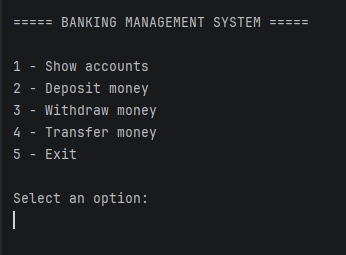
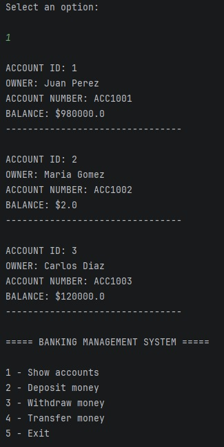
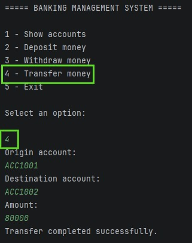
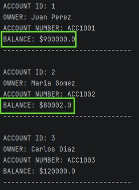

# Banking Management System

Backend banking system developed in Java and MySQL using JDBC and DAO architecture.

This project simulates basic banking operations including account management, deposits, withdrawals and money transfers with transactional control.

---

## Features

- Account visualization
- Deposit money
- Withdraw money
- Transfer money between accounts
- Account validation
- Insufficient funds validation
- SQL transaction management
- Rollback and commit implementation
- Console interaction system

---

## Technologies Used

- Java 17
- MySQL
- JDBC
- Maven
- IntelliJ IDEA

---

## Project Structure

```text
src/main/java

├── model
│   └── Account.java

├── dao
│   └── AccountDAO.java

├── database
│   └── DatabaseConnection.java

├── service

└── Main.java
```

---

## Database Model

The system manages banking accounts with:

- Account owner
- Unique account number
- Current balance

---

## Implemented Operations

### READ
Display all accounts stored in MySQL.

### DEPOSIT
Add money to existing accounts.

### WITHDRAW
Withdraw money with balance validation.

### TRANSFER
Transfer money between accounts using SQL transactions.

---

## Technical Concepts Applied

- Object-Oriented Programming (OOP)
- DAO Pattern
- JDBC Integration
- SQL Transactions
- Commit / Rollback
- PreparedStatement usage
- Database Persistence
- Console Input Handling
- Layered Architecture

---

## Database Setup

1. Install MySQL Server
2. Open MySQL Workbench
3. Execute the SQL script located in:

```text
sql/setup.sql
```

This will automatically create:
- the database
- the accounts table
- sample banking accounts

---

## Screenshots

### Main Menu



### Account List



### Banking Operations





---

## Author

Developed by Tomas Figini